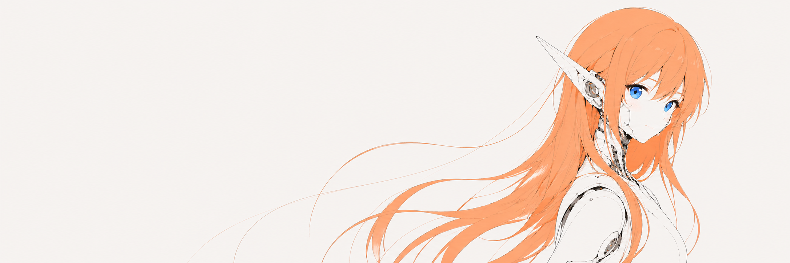

  

<h1 align="center">SERIO_AI</h1>

  <strong>Make something with U.</strong> 
  @BURNTGOGI · PUBLIC BUILDS

---

## BUILDER INDEX

<!-- AUTO:BUILDER-INDEX:START -->

### MOST STARRED

| Repository | Stars | About |
| --- | ---: | --- |
| **[ai-slop-thresher](<https://github.com/Burntgogi/ai-slop-thresher>)** | ⭐ 45 | AI Slop 탈곡기 · 한국어 글의 AI 말투와 과잉 설명을 다듬는 Codex 스킬. |
| **[kar-plain](<https://github.com/Burntgogi/kar-plain>)** | ⭐ 43 | A compact Codex skill for explanations in Korean or English: prose, diagrams, web pages, and videos. |
| **[codex\_oracle](<https://github.com/Burntgogi/codex_oracle>)** | ⭐ 11 | Codex second-opinion reviews. |
| **[Gpt\_Codex\_HWP](<https://github.com/Burntgogi/Gpt_Codex_HWP>)** | ⭐ 5 | Safe HWPX authoring and validation. |

### RECENTLY UPDATED

- **[Everything\_Mew](<https://github.com/Burntgogi/Everything_Mew>)** — Read-only Windows search for agents. 
  Last code push: 2026-10-07 · ⭐ 1

[View all public repositories →](https://github.com/Burntgogi?tab=repositories&sort=stargazers)

### WEB PAGES

| Page | About |
| --- | --- |
| [Serio · VTuber](<https://serio-vtuber.serio-ai.chatgpt.site/>) | Serio의 표정과 립싱크를 체험하는 아바타 스튜디오. |
| [경복궁 근정전 · 일반 3D와 복셀](<https://geunjeongjeon-dot-viewer.serio-ai.chatgpt.site/>) | Dot의 근정전 모델을 일반 3D와 복셀로 살펴보는 웹 뷰어. |
| [Grokbot Icon Studio](<https://grokbot-icon-studio.serio-ai.chatgpt.site/>) | 미니멀 봇 아이콘 예시와 제작 프롬프트. |
| [솜솜뭉치 딸깍공장](<https://plush-toy.serio-ai.chatgpt.site/>) | 캐릭터를 봉제인형으로 바꾸는 이미지 예시와 프롬프트. |
| [TIBOKAT · @thsottiaux](<https://tibokat.serio-ai.chatgpt.site/>) | Tibo의 Codex 사용량 초기화 소식을 살펴보는 페이지. |
| [ボットでGO\! β](<https://bot-de-go-beta.serio-ai.chatgpt.site/>) | 철도 노선에 봇과 차량 정보를 함께 더하는 참여형 지도. |

### BENCHMARKS

#### 추론 설정 비교

추론 강도와 토큰 상한을 바꾼 생성 결과를 비교합니다.

| Page | About |
| --- | --- |
| [펠리컨 · Reasoning Effort × Cap](<https://pelican-reasoning-effort-cap.serio-ai.chatgpt.site/>) | medium/xhigh와 6K·8K·12K·캡 없음 조건의 원본 결과 재생 비교. |
| [Qwen 3.8 Flash Next · Reasoning Cap](<https://qwen38-flash-next-reasoning-cap.serio-ai.chatgpt.site/>) | 6K·8K·12K·16K 추론 상한에 따른 복셀 생성 결과 비교. |

#### 복셀 파고다 · 모델별 결과

파고다와 벚꽃 정원을 생성한 모델별 결과를 함께 살펴봅니다.

| Page | About |
| --- | --- |
| [Qwen 3.8 27B · Q5KM](<https://qwen38-27b-q5km-pagoda.serio-ai.chatgpt.site/>) | Qwen38\_27B\_Q5KM\_pagoda.html |
| [Qwen 3.8 Flash Next Coder · IQ1M](<https://qwen38-flashnext-coder-iq1m-pagoda.serio-ai.chatgpt.site/>) | Qwen38FlashNextCoder\_IQ1M\_pagoda.html |
| [Sol 6.1 · high](<https://sol-6-1-high-pagoda.serio-ai.chatgpt.site/>) | sol\_6\_1\_high\_pagoda.html |
| [Qwen 3.8 Flash Next · IQ3](<https://qwen38flashnext-iq3-pagoda.serio-ai.chatgpt.site/>) | Qwen38Flashnext\_IQ3\_pagoda.html |

### OPEN-SOURCE PAGES

[Browse the web & open-source showcase →](https://github.com/Burntgogi/Burntgogi/blob/main/PROJECTS.md)

Top 4 by stars + 1 recently updated project · refreshed every 6 hours.

<!-- AUTO:BUILDER-INDEX:END -->
